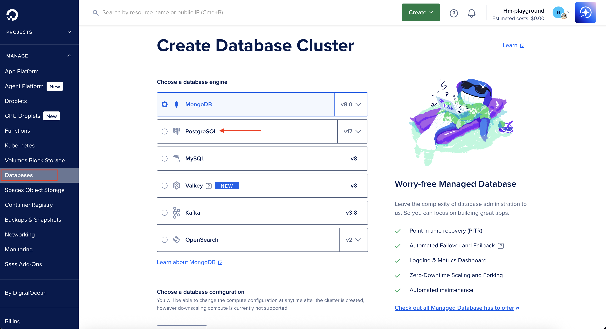

# Next.js SaaS Starter

This is a starter template for building a SaaS application using **Next.js** with support for authentication, Stripe integration for payments, and a dashboard for logged-in users.

**Demo: [https://orca-app-g3y29.ondigitalocean.app/](https://orca-app-g3y29.ondigitalocean.app/)**

## Features

- Marketing landing page (`/`) with animated Terminal element
- Pricing page (`/pricing`) which connects to Stripe Checkout
- Dashboard pages with CRUD operations on users/teams
- Basic RBAC with Owner and Member roles
- Subscription management with Stripe Customer Portal
- Email/password authentication with JWTs stored to cookies
- Global middleware to protect logged-in routes
- Local middleware to protect Server Actions or validate Zod schemas
- Activity logging system for any user events

## Tech Stack

- **Framework**: [Next.js](https://nextjs.org/)
- **Database**: [DigitalOcean Managed PostgreSQL Database](https://www.digitalocean.com/products/managed-databases)
- **Deployment**: [DigitalOcean App Platform](https://www.digitalocean.com/products/app-platform)
- **ORM**: [Drizzle](https://orm.drizzle.team/)
- **Payments**: [Stripe](https://stripe.com/)
- **UI Library**: [shadcn/ui](https://ui.shadcn.com/)

## Getting Started

```bash
git clone https://github.com/nextjs/saas-starter
cd saas-starter
pnpm install
```

## Database Setup

### DigitalOcean Managed Database

**Setting up Postgres DB on DigitalOcean**

1. **Create a DigitalOcean Account**: Sign up at [digitalocean.com](https://digitalocean.com)

2. **Create a Managed Database**:
   - Login to DigitalOcean and navigate to **Databases**
   - Click on **Create Database**
   - To create a database cluster, choose a region and scroll down to choose **PostgreSQL** as the database engine.
   
   - Select a pricing plan of your choice, and then click on the **Create Database Cluster** button to start creating the database
   - Once the database is provisioned, it will give you details on the port, password, and host URL to connect to Postgres
   - You can now add these in your `.env` file to connect to DigitalOcean's Managed Postgres DB

5. **Deploy using App Platform**:
   - Push your code to a GitHub repository
   - Go to [DigitalOcean App Platform](https://cloud.digitalocean.com/apps)
   - Click "Create App" and select your repository
   - DigitalOcean will automatically detect the `do-app-platform.yaml` file
   - Configure your environment variables:
     - `AUTH_SECRET`: Generate with `openssl rand -base64 32`
     - `STRIPE_SECRET_KEY`: Your Stripe secret key
     - `STRIPE_WEBHOOK_SECRET`: Your Stripe webhook secret
     - `BASE_URL`: Will be set automatically to your app URL
     - `POSTGRES_URL`: This you will get from the DigitalOcean control panel

6. **Database Configuration**: The `do-app-platform.yaml` file automatically:
   - Creates a managed PostgreSQL database
   - Sets up the connection string as `POSTGRES_URL`
   - Runs migrations automatically on deployment


## Running Locally

[Install](https://docs.stripe.com/stripe-cli) and log in to your Stripe account:

```bash
stripe login
```

Use the included setup script to create your `.env` file:

```bash
pnpm db:setup
```

Run the database migrations and seed the database with a default user and team:

```bash
pnpm db:migrate
pnpm db:seed
```

This will create the following user and team:

- User: `test@test.com`
- Password: `admin123`

You can also create new users through the `/sign-up` route.

Finally, run the Next.js development server:

```bash
pnpm dev
```

Open [http://localhost:3000](http://localhost:3000) in your browser to see the app in action.

You can listen for Stripe webhooks locally through their CLI to handle subscription change events:

```bash
stripe listen --forward-to localhost:3000/api/stripe/webhook
```

## Testing Payments

To test Stripe payments, use the following test card details:

- Card Number: `4242 4242 4242 4242`
- Expiration: Any future date
- CVC: Any 3-digit number

## Going to Production

When you're ready to deploy your SaaS application to production, follow these steps:

### Set up a production Stripe webhook

1. Go to the Stripe Dashboard and create a new webhook for your production environment.
2. Set the endpoint URL to your production API route (e.g., `https://yourdomain.com/api/stripe/webhook`).
3. Select the events you want to listen for (e.g., `checkout.session.completed`, `customer.subscription.updated`).

### Deployment Options

#### Deploy to DigitalOcean App Platform (Recommended)

This project includes a `do-app-platform.yaml` file for seamless deployment:

1. Push your code to a GitHub repository.
2. Go to [DigitalOcean App Platform](https://cloud.digitalocean.com/apps).
3. Click "Create App" and select your repository.
4. DigitalOcean will automatically detect the `do-app-platform.yaml` file and configure:
   - Managed PostgreSQL 15 database
   - Node.js application environment
   - Automatic builds and deployments
   - Environment variable management

5. Configure your environment variables in the DigitalOcean dashboard:
   - `AUTH_SECRET`: Generate with `openssl rand -base64 32`
   - `STRIPE_SECRET_KEY`: Your Stripe production secret key
   - `STRIPE_WEBHOOK_SECRET`: Your Stripe webhook secret
   - `BASE_URL`: Will be set automatically to your app URL
   - `POSTGRES_URL`: Automatically configured by DigitalOcean


## Other Templates

While this template is intentionally minimal and to be used as a learning resource, there are other paid versions in the community which are more full-featured:

- https://achromatic.dev
- https://shipfa.st
- https://makerkit.dev
- https://zerotoshipped.com
- https://turbostarter.dev
